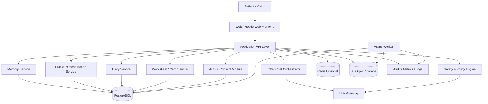
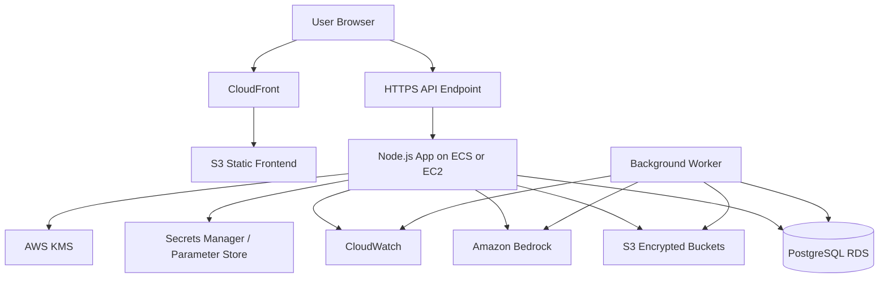
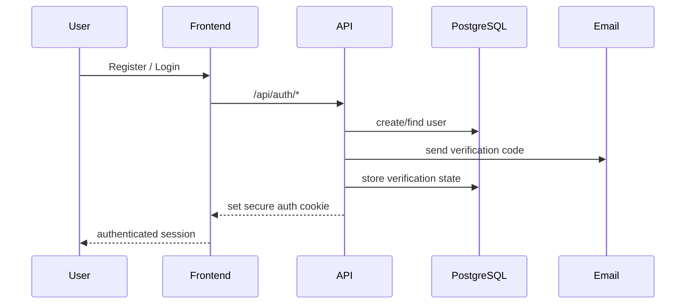
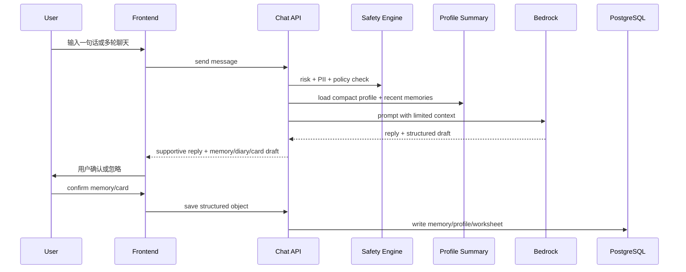
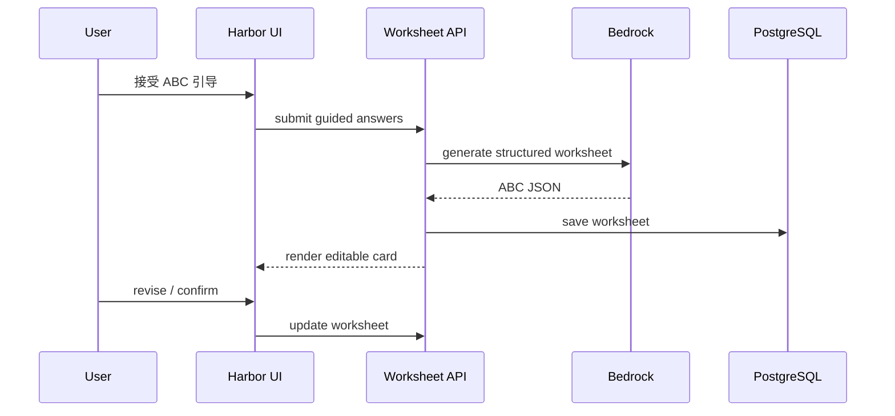

# Mind Islands 数据流与软件架构设计文档

- Product: Mind Islands
- Version: v1.0
- Date: 2026-07-20
- Status: Draft
- Audience: Product, Engineering, Security, Operations, Institutional Partners
- Scope: Otter chat, shell memories, emotional diary, Harbor support, ABC worksheet/cards, profile personalization, AWS deployment

## 1. 文档目标

本文档用于定义 Mind Islands 作为心理疗愈机构面向患者与访客的数字陪伴工具时，推荐采用的数据流和软件架构方案。目标是在以下四个原则之间取得平衡：

1. 数据安全与隐私保护优先
2. 控制 LLM 与基础设施成本
3. 减少长期存储空间占用
4. 保持聊天与记录交互流畅

本文档同时考虑了当前仓库已有实现基础：

- 前端为 `React + Vite + TypeScript`
- 后端为 `Express + PostgreSQL`
- 已存在用户认证、邮件验证、应用层加密、memory/profile 数据结构
- 已存在 Quick Log、Harbor、memory 保存、profile summary 等产品雏形

因此，推荐方案以“可渐进落地的模块化单体架构（modular monolith）”为主，而不是一开始拆成高运维成本的微服务。

## 2. 产品能力边界

### 2.1 核心产品对象

Mind Islands 的核心体验围绕以下对象构建：

| 产品对象 | 用户感知 | 系统角色 |
| --- | --- | --- |
| 小海獭 Otter Companion | 及时反馈、温柔陪伴、引导表达 | AI 对话入口与个性化响应层 |
| 贝壳记忆 Shell Memory | 不同颜色的记忆贝壳，对应被保存的重要片段 | 用户长期记忆对象 |
| Emotional Diary 情绪日记 | 将聊天记录整理成每日情绪摘要 | 结构化日记产物 |
| Harbor / 栖息地 | 更深层的情绪承接、自我安抚、呼吸练习 | 支持模式与干预模式 |
| ABC Worksheet / 心理卡片 | 将对话转为可复盘的结构化练习卡 | 干预结果与临床辅助材料 |
| User Profile / 画像 | 用户稳定偏好、触发点、支持风格 | 个性化上下文 |

### 2.2 非目标

以下能力不建议在第一阶段成为核心架构复杂度来源：

- 实时多租户临床工作台
- 大规模向量知识库
- 多模型自动编排平台
- 全量永久保存所有原始聊天逐字稿
- 复杂微服务拆分

## 3. 设计原则

### 3.1 数据最小化

不保存“能不用就不用”的数据。原始聊天全文不应无限期保留，优先保留：

- 用户明确确认的 memory
- 结构化 diary
- worksheet/card
- 紧凑型 profile summary
- 最少必要的审计日志

### 3.2 结构化优先于全文堆积

长期可复用价值来自结构化对象，而不是海量聊天文本。系统应尽快把原始输入转为：

- memory events
- profile facts
- diary entries
- intervention cards
- todo / follow-up items

### 3.3 同步交互轻，异步整理重

用户聊天时只做必须的同步工作：

- 风险识别
- 个性化 prompt 组装
- LLM 生成回复
- 返回 memory/diary/card 草稿

较重任务异步处理：

- 每日情绪日记归档
- profile summary 重建
- analytics 聚合
- 长文本压缩

### 3.4 安全默认开启

所有敏感数据链路默认：

- TLS 传输
- 服务端鉴权
- 应用层加密敏感文本
- 最小权限 IAM
- 审计日志
- 数据删除与保留策略

### 3.5 模块化单体优先

对当前阶段最合适的工程形态是：

- 一个 Web 前端
- 一个 API 应用
- 一个 PostgreSQL 主数据库
- 一个异步任务 worker
- 一个对象存储层

这比微服务更便宜、更易维护，也更适合当前功能边界。

## 4. 推荐总体架构

### 4.1 逻辑架构

### 4.2 部署架构

### 4.3 推荐技术选型

| 层级 | 推荐方案 | 说明 |
| --- | --- | --- |
| Frontend | React + Vite | 与当前仓库一致 |
| API | Node.js + Express | 与当前后端一致，改造成本最低 |
| Primary DB | PostgreSQL on RDS | 已有数据模型可直接承接 |
| Object Storage | Amazon S3 | 存储导出文件、归档日志、附件 |
| LLM | Amazon Bedrock first | 更适合 AWS 内部安全治理与审计 |
| Secrets | AWS Secrets Manager | 存放 DB、SMTP、LLM 密钥 |
| Encryption | KMS + app-layer encryption | 兼顾云层和字段级保护 |
| Background Jobs | Worker process + queue table | 初期不必上复杂 MQ |
| Cache | Redis optional | 仅在高频对话和限流场景需要 |

## 5. 核心领域服务

### 5.1 Auth & Consent

负责：

- 注册、登录、会话管理
- 邮箱验证
- 用户数据授权开关
- memory 保存许可
- AI personalization 许可
- Harbor memory 许可
- 数据导出与删除申请

### 5.2 Otter Chat Orchestrator

负责：

- 接收用户输入
- 调用安全策略引擎
- 组装 prompt
- 挑选上下文
- 调用 LLM
- 将模型输出转成产品内部 JSON
- 生成 reply、memory draft、todo draft、worksheet suggestion

### 5.3 Memory Service

负责：

- 保存贝壳记忆
- 标签与岛屿分类
- pinned memories
- sensitivity level
- memory 删除与回收
- 从 memory 反推 profile facts

### 5.4 Diary Service

负责：

- 将一天的聊天与已确认 memory 压缩为日记
- 生成日/周情绪摘要
- 输出趋势视图和复盘入口

### 5.5 Worksheet / Card Service

负责：

- 生成 ABC worksheet
- grounding card
- emotion reflection card
- breathing / coping practice card
- 保存 worksheet 状态与后续补充

### 5.6 Profile Personalization Service

负责：

- 保存稳定型用户画像
- 输出紧凑 summary 供 LLM 读取
- 记录 evidence memory ids
- 支持可解释、可撤回的 profile facts

### 5.7 Safety & Policy Engine

负责：

- 敏感词与风险识别
- 自伤/他伤/危机识别
- prompt 注入与越权内容阻断
- PII/PHI 过滤与掩码
- 切换到 Harbor 或人工协助流程

## 6. 端到端数据流

### 6.1 用户注册与会话流

关键要求：

- 使用 HTTP-only secure cookie
- 所有数据访问必须服务端带 user_id 过滤
- 同意设置单独持久化，不能隐式开启长期记忆

### 6.2 Quick Log / 海獭聊天流

同步返回内容建议为：

- `assistant_reply`
- `memory_draft`
- `quick_preview`
- `worksheet_suggestion`
- `safety_handoff`

不建议同步做的事：

- 全量长期 embedding
- 大批量 profile 重建
- 重型 analytics 计算

### 6.3 贝壳记忆流

1. 用户输入一段对话、日常事件或感受
2. LLM 先生成 memory draft，而不是直接落库
3. 用户确认后写入 `user_memory_events`
4. 系统自动补上：
   `tags`, `islands`, `template`, `sensitivity_level`, `source_message`
5. 若 profile learning 打开，则从该 memory 抽取稳定画像信号
6. 异步刷新 profile summary

设计价值：

- 降低误存
- 减少垃圾数据
- 减少后续纠错成本

### 6.4 情绪日记流

1. 用户一天中可能有多次 Quick Log、Harbor 对话或 quick check-in
2. 系统不必永久保留全部原始对话
3. 每日定时任务从以下来源生成 diary：
   confirmed memories
   day-level mood/check-in events
   explicitly saved Harbor reflections
4. 生成 `diary_entry`
5. 将 diary 与 memory 做弱关联，而不是复制全文
6. 超过保留周期的原始消息可压缩或删除

### 6.5 Harbor / 栖息地支持流

1. Safety engine 检测到用户情绪负荷较高
2. Quick Log 不继续做普通记录式响应
3. 系统发起 Harbor handoff
4. Harbor 模式使用不同 system prompt
5. Harbor 可输出：
   grounding
   breathing
   emotion reflection
   ABC guidance
6. 用户若选择保存，则只保存整理后的摘要或卡片，不强制保存全部原始对话

### 6.6 ABC Worksheet / 心理卡片流

建议 ABC card 字段：

- activating_event
- belief_or_interpretation
- emotional_consequence
- alternate_view
- tiny_next_step
- created_from_memory_ids
- clinician_visible flag

### 6.7 Profile 个性化流

1. Memory 保存成功后，系统抽取稳定事实
2. 事实进入 `user_profile_facts`
3. 每条 fact 保留置信度和证据 memory ids
4. 定时或事件驱动重建 `user_profile_summaries`
5. LLM 推理时只注入紧凑 summary，而不是全量 profile facts

这一步是降低 token 成本和提升响应速度的关键。

## 7. 推荐数据模型

### 7.1 核心表

| 表名 | 用途 | 存储建议 |
| --- | --- | --- |
| `users` | 用户基础身份 | RDS |
| `email_verifications` | 邮件验证与风控 | RDS |
| `user_states` | 当前 app state | RDS，必要时加密 |
| `user_memory_settings` | 用户授权与个性化开关 | RDS |
| `user_memory_events` | 贝壳记忆 | RDS，敏感字段应用层加密 |
| `user_profile_facts` | 可解释画像事实 | RDS，加密 value |
| `user_profile_summaries` | LLM 用紧凑画像摘要 | RDS，加密 summary |
| `conversation_sessions` | 对话会话元信息 | RDS |
| `conversation_messages` | 原始聊天消息 | RDS 或 S3 归档，设置 TTL |
| `diary_entries` | 日/周情绪日记 | RDS |
| `worksheets` | ABC / grounding / reflection cards | RDS |
| `intervention_events` | 危机分流、呼吸练习、干预启动记录 | RDS |
| `audit_events` | 安全审计 | RDS 或日志系统 |

### 7.2 与当前代码的映射

当前后端已经具备较好的基础映射：

| 当前对象 | 建议业务含义 |
| --- | --- |
| `user_memory_events` | Shell memories |
| `user_profile_facts` | Explainable profile facts |
| `user_profile_summaries` | Compact personalization context |
| `user_memory_settings` | Consent and personalization toggles |

建议新增：

- `conversation_sessions`
- `conversation_messages`
- `diary_entries`
- `worksheets`
- `intervention_events`

### 7.3 对话存储策略

为节省空间和降低合规风险，建议分层保留：

| 数据层 | 保存内容 | 建议保留 |
| --- | --- | --- |
| Hot | 最近对话、等待确认草稿 | 7 到 30 天 |
| Warm | 已确认 memory、worksheets、diaries | 长期 |
| Cold | 合规归档或审计日志 | S3 生命周期管理 |

原则：

- 长期价值留结构化对象
- 原始聊天逐字稿短保留
- 不在 profile 中存聊天全文

## 8. LLM 接入设计

### 8.1 推荐方案

优先推荐通过服务端接入 Amazon Bedrock，而不是浏览器直接连模型提供商接口。

原因：

1. 安全边界更清晰
2. 便于统一审计、限流、重试和提示词治理
3. 更容易在 AWS 内完成身份、密钥和网络控制
4. 更适合处理心理健康相关敏感数据

补充说明：

- 截至 2026-07-20，Amazon Bedrock 支持按 account 或 project 配置数据保留策略，支持 zero data retention 模式的治理思路
- 若机构对 PHI 或跨境数据更敏感，建议优先选择支持目标保留策略和目标区域的模型

### 8.2 LLM Gateway 职责

LLM Gateway 负责：

- 模型路由
- prompt template 管理
- PII/PHI redaction
- token 预算控制
- 响应 JSON schema 校验
- fallback model 机制
- 超时与重试

### 8.3 模型使用建议

| 任务 | 推荐模型策略 |
| --- | --- |
| 实时聊天回复 | 低延迟主模型 |
| memory/diary 结构化提取 | 低成本结构化模型 |
| ABC worksheet 生成 | 中等质量模型 |
| 高风险对话判断 | 规则引擎 + 小模型双重判断 |
| 周报/总结 | 异步模型任务 |

### 8.4 Prompt 上下文控制

每次推理只注入：

- 最近 6 到 20 条有效消息
- 一份紧凑 profile summary
- 3 到 8 条最相关 memories
- 当前模式说明

不要注入：

- 全量聊天历史
- 全量用户档案
- 历史 diary 全文

这是成本控制和响应速度优化的核心。

## 9. AWS 参考架构建议

### 9.1 推荐落地路径

#### 方案 A：当前阶段推荐，低改造成本

- CloudFront + S3 托管前端静态资源
- 单个 Node.js API 应用
- PostgreSQL on RDS
- Bedrock 作为 LLM provider
- S3 存归档和导出
- Secrets Manager 管理密钥

适合：

- 早中期产品
- 团队人数较少
- 需要快速上线与低维护成本

#### 方案 B：流量增长后演进

- ECS service for API
- 独立 worker service
- Redis for cache / rate limiting
- 读写分离或只读副本

适合：

- 机构试点扩大
- 同时在线用户增长
- 需要更强韧性

### 9.2 组件说明

| AWS 组件 | 作用 | 是否第一阶段必须 |
| --- | --- | --- |
| CloudFront | CDN、TLS、前端加速 | 是 |
| S3 | 前端静态托管、归档、导出 | 是 |
| RDS PostgreSQL | 主业务数据库 | 是 |
| EC2 或 ECS | 承载 Node API | 是 |
| Bedrock | LLM 接入 | 是 |
| KMS | 密钥管理 | 是 |
| Secrets Manager | 管理敏感配置 | 是 |
| CloudWatch | 日志与监控 | 是 |
| WAF | Web 攻击防护 | 建议 |
| Redis | 缓存、限流、短期上下文 | 否 |

### 9.3 EC2 还是 ECS/Fargate

建议基于阶段选择：

| 方案 | 优点 | 缺点 | 适用阶段 |
| --- | --- | --- | --- |
| Single EC2 app node | 成本最低，和当前项目最匹配 | 扩容、部署、容灾更手工 | 小规模试点 |
| ECS on EC2 | 更规范，ECS 本身无额外管理费 | 仍要管 EC2 宿主机 | 稳定增长 |
| ECS on Fargate | 少运维、弹性更好 | 长期开机通常贵于单 EC2 | 波动流量或团队缺运维 |

结论：

- 若当前流量不高，优先“单 EC2 或 ECS on EC2”
- 若机构级流量波动明显，改用 Fargate 更省心

## 10. 安全与隐私设计

### 10.1 数据分级

| 级别 | 示例 | 策略 |
| --- | --- | --- |
| Public | 静态前端资源 | CloudFront + S3 |
| Internal | 产品配置、文案模板 | Parameter Store / repo |
| Sensitive | 聊天、memory、diary、worksheet | 应用层加密 + RDS 加密 |
| Highly Sensitive | 危机标记、医疗相关事实、机构标识 | 字段级加密、最小访问面、审计 |

### 10.2 基础安全控制

必须具备：

- HTTPS only
- Secure + HTTP-only cookie
- 服务端鉴权和对象级 user_id 隔离
- PostgreSQL 私网访问
- 对 Bedrock 等关键服务优先使用 VPC endpoint / PrivateLink 方案
- 字段级 AES-GCM 或等价应用层加密
- 密钥存于 KMS / Secrets Manager
- 速率限制
- 审计日志
- 定期备份与恢复演练

### 10.3 LLM 安全控制

必须具备：

- 输入输出敏感信息过滤
- 危机语言识别
- prompt injection 防护
- 工具调用白名单
- 不允许模型直接访问数据库
- 不允许前端持有模型密钥

### 10.4 危机处理机制

对于自伤、他伤、极端绝望等高风险信号：

1. 立即停止普通同伴式对话逻辑
2. 输出固定安全响应模板
3. 引导联系真人支持、热线或机构流程
4. 记录 `intervention_event`
5. 若机构要求，可触发人工 review 队列

### 10.5 合规备注

若机构数据涉及 PHI 或受医疗合规约束，应额外确认：

- AWS 账户已接受相应 BAA
- 所用 AWS 服务在目标合规范围内
- 数据保留、导出、删除政策已成文
- 机构内部已有 incident response 流程

本文档不替代法律或合规意见，但架构上应为合规预留控制点。

## 11. 成本优化策略

### 11.1 LLM 成本优化

1. 对话只带最小必要上下文
2. 用 compact profile summary 代替全量历史
3. 将 diary/weekly summary 放到异步任务
4. 用小模型做分类、抽取、改写
5. 只有在 Harbor 深度支持或 worksheet 生成时才调用更强模型
6. 对重复 prompt 模板做缓存
7. 为每个功能设置 token budget

### 11.2 数据库存储优化

1. Memory 存结构化字段，不存冗余副本
2. Diary 只引用相关 memory ids，不复制全文
3. Profile 存 summary 和 evidence，不存全对话
4. 删除过期 raw messages
5. JSONB 字段只用于半结构化字段，避免滥用

### 11.3 对象存储优化

S3 用于：

- 导出文件
- 合规归档
- 过期消息冷存储
- 机构报表快照

并配置 lifecycle：

- 30 到 90 天后转低成本存储层
- 更久后删除或归档

### 11.4 基础设施优化

1. 早期避免过早拆微服务
2. 前端走 S3 + CloudFront，减少应用服务器静态资源开销
3. DB 从小规格开始，但监控 CPU credit 和 IOPS
4. 长驻低流量阶段优先单 EC2 或 ECS on EC2
5. 峰值明显时再上 Fargate 或自动扩容

## 12. 低延迟与流畅交互设计

### 12.1 响应时间目标

建议目标：

| 交互类型 | 目标时间 |
| --- | --- |
| 打开首页 | < 2 秒 |
| Quick check-in 提交 | < 1 秒 |
| Otter 首字响应 | 1.5 到 3 秒 |
| Memory 确认保存 | < 1 秒 |
| ABC card 生成 | 2 到 5 秒 |

### 12.2 技术策略

1. 使用 streaming response 返回聊天内容
2. 首条回复先返回情绪承接，结构化草稿后补
3. profile summary 预先缓存
4. recent memories 走轻量查询
5. 非关键 analytics 后台算
6. 前端 optimistic UI 呈现“已保存草稿”

### 12.3 检索策略

第一阶段不建议立即上独立向量数据库。

优先方案：

- profile summary
- recent pinned memories
- tag / island / recency 检索
- 手工 relevance scoring

只有当以下条件出现时再考虑 `pgvector` 或专门向量库：

- memory 规模明显增长
- 跨时间主题召回精度不足
- LLM personalization 效果依赖语义检索

## 13. 推荐保留策略

| 数据类型 | 建议保留期 | 备注 |
| --- | --- | --- |
| Session tokens / verification codes | 分钟到天级 | 自动过期 |
| Raw conversation messages | 7 到 30 天 | 可按机构政策调整 |
| Confirmed shell memories | 长期 | 用户可删除 |
| Profile facts | 长期 | 需可撤回 |
| Diary entries | 长期 | 结构化压缩产物 |
| Worksheets | 长期 | 属于治疗辅助记录 |
| Audit logs | 90 天到 1 年 | 按合规策略调整 |
| Backups | 14 daily + monthly copies | 需恢复演练 |

## 14. 分阶段落地路线图

### Phase 1: Secure MVP

目标：

- 打通海獭聊天、memory 保存、profile summary、Harbor handoff

交付：

- Bedrock server-side integration
- `conversation_sessions/messages`
- `diary_entries`
- `worksheets`
- 应用层加密扩展
- 基础审计日志

### Phase 2: Scale & Optimize

目标：

- 降本增效，提升稳定性和机构可运营性

交付：

- worker 异步日记生成
- profile summary 重建任务
- Redis 缓存与限流
- S3 冷归档
- 监控与告警

### Phase 3: Clinical Partnership Readiness

目标：

- 面向机构试点或更高合规要求

交付：

- 更严格的 retention policy
- human review queue
- export / delete workflows
- 更完整的 security review
- 机构侧 dashboard 或运营接口

## 15. 建议的关键决策

在正式开发前，建议团队先定下这 8 个决策：

1. 是否将 Amazon Bedrock 作为默认 LLM 接入层
2. 原始聊天逐字稿保留多少天
3. Harbor 对话是否默认不长期保存全文
4. ABC worksheet 是否默认需要用户确认后才落库
5. 机构是否需要人工危机介入队列
6. 是否存在 PHI / HIPAA / 本地医疗数据要求
7. 第一阶段是否接受单 EC2 应用部署
8. 多语言数据是否统一存原文，不做强制翻译归档

## 16. 结论

对于 Mind Islands 这种“心理支持 + 记忆沉淀 + 个性化对话”的产品，最优先的不是把系统做大，而是把系统做稳、做轻、做可解释。

推荐架构结论如下：

1. 采用模块化单体架构，而不是微服务
2. 以 PostgreSQL 作为主存储，以 S3 作为归档和对象存储
3. 通过服务端接入 Amazon Bedrock，避免浏览器直接触达 LLM
4. 长期保存结构化对象，短期保存原始聊天
5. 用 compact profile summary 降低 token 成本并提升响应速度
6. 将 diary、profile rebuild、analytics 放入异步任务
7. 以字段级加密、最小权限和审计日志作为默认基线

这套方案和当前仓库已经存在的 `Express + PostgreSQL + memory/profile encryption` 基础是兼容的，可以在不大幅重写的前提下逐步演进到更专业、可审计、可合作交付的机构级产品。

## 17. 外部参考

以下官方资料用于校准本文档中的 AWS 方向与成本/安全判断，检索日期为 2026-07-20：

- Amazon Bedrock overview: https://docs.aws.amazon.com/bedrock/latest/userguide/what-is-bedrock.html
- Amazon Bedrock pricing: https://aws.amazon.com/bedrock/pricing/
- Amazon Bedrock security/compliance: https://aws.amazon.com/bedrock/security-compliance/
- Amazon Bedrock guardrails: https://docs.aws.amazon.com/bedrock/latest/userguide/guardrails.html
- Amazon Bedrock data retention: https://docs.aws.amazon.com/bedrock/latest/userguide/data-retention.html
- Amazon Bedrock data encryption: https://docs.aws.amazon.com/bedrock/latest/userguide/data-encryption.html
- AWS Fargate pricing: https://aws.amazon.com/fargate/pricing/
- Amazon ECS pricing: https://aws.amazon.com/ecs/pricing/
- Amazon RDS for PostgreSQL pricing: https://aws.amazon.com/rds/postgresql/pricing/
- Amazon CloudFront pricing: https://aws.amazon.com/cloudfront/pricing/
- AWS KMS pricing: https://aws.amazon.com/kms/pricing/
- AWS Secrets Manager overview: https://docs.aws.amazon.com/secretsmanager/latest/userguide/intro.html
- Amazon S3 lifecycle management: https://docs.aws.amazon.com/AmazonS3/latest/userguide/object-lifecycle-mgmt.html
